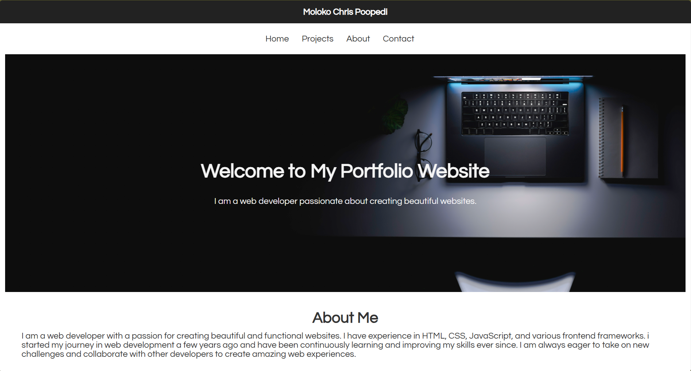
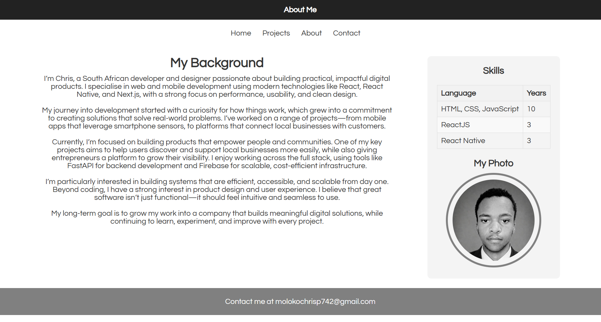
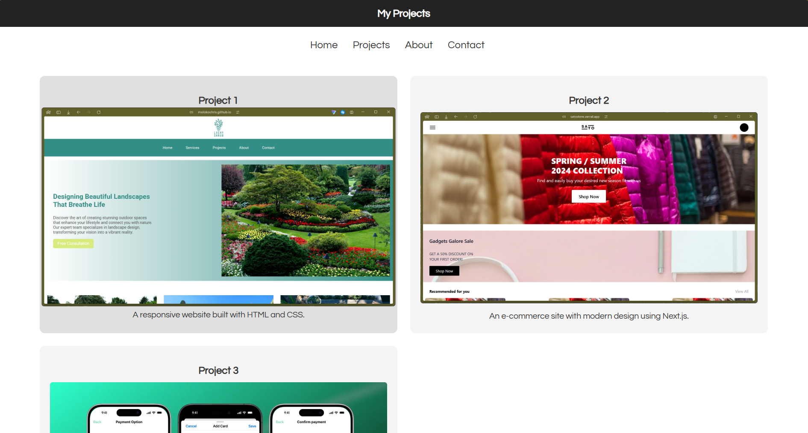
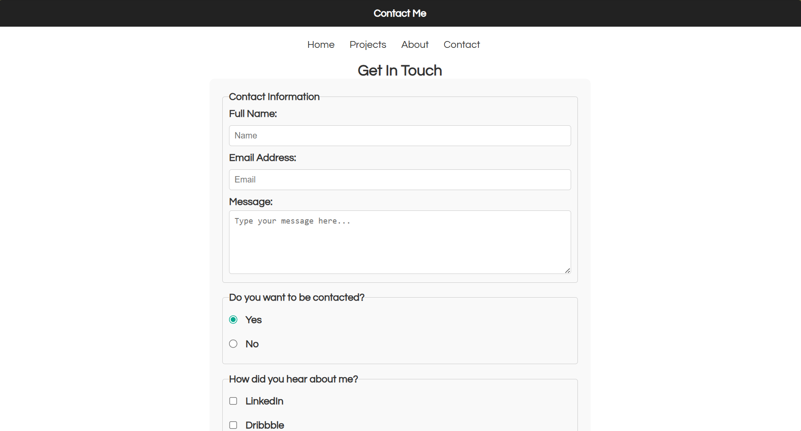
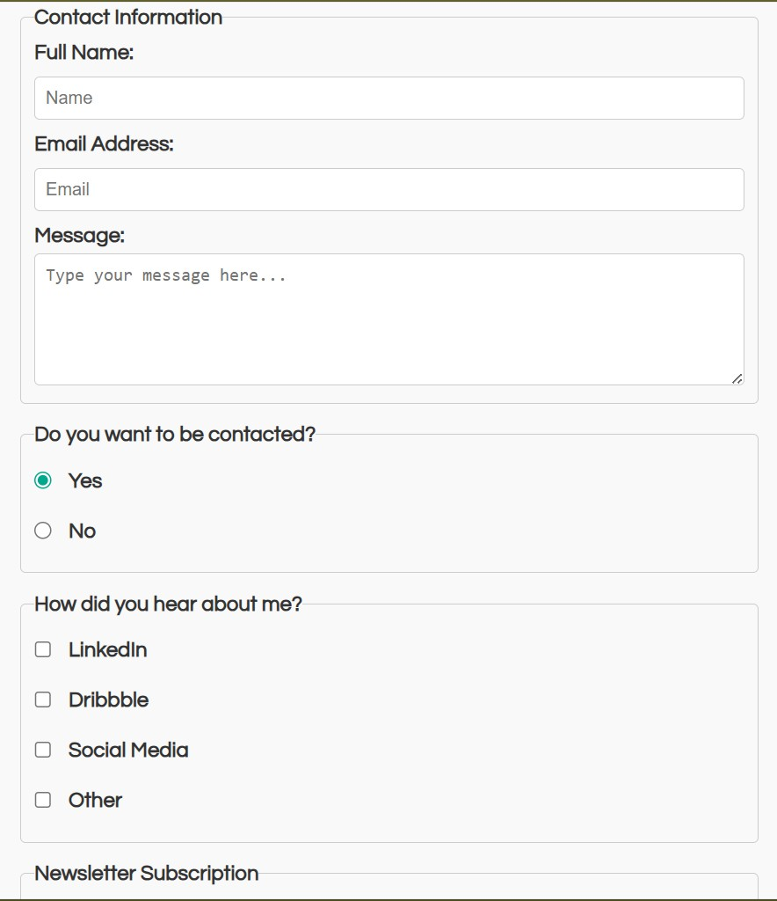
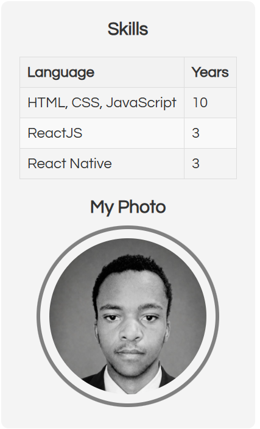
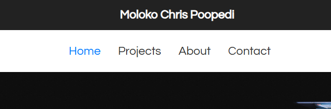
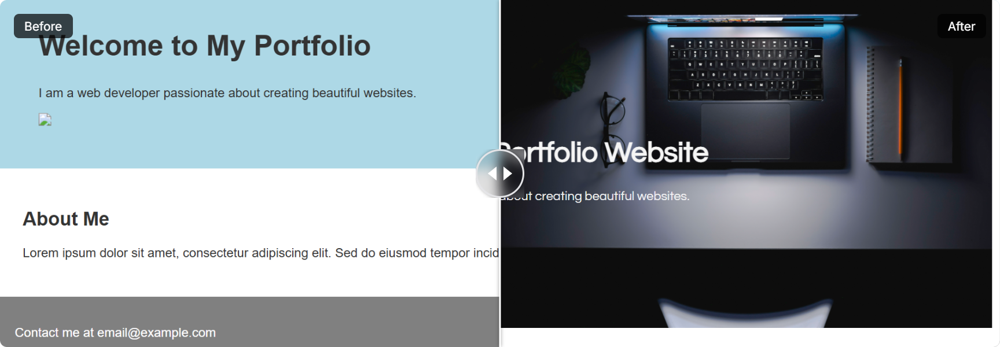

# Portfolio Website

### Moloko Chris Poopedi | Umuzi x BBD Capstone 1

---

## Overview

This is a multi-page portfolio website built using HTML and CSS. The project
was completed as part my Capstone 1 - Debug Portfolio Website assignment.
This task involved taking a broken starter codebase that is approximately 70%
complete with 41 intentional errors and debugging, fixing, and enhancing it into
a fully functional, accessible, and professionally styled website.

The website consists of four pages: a homepage, a projects page, an about page,
and a contact page.

---

## Issues Found

41 intentional errors across 5 files. The major issues identified
are documented below.

### HTML Issues

- All four pages were missing `charset` and `viewport` meta tags
- The `<html>` element was missing the `lang` attribute on three pages
- Navigation was completely absent on three pages
- All content was wrapped in non-semantic `<div>` tags with no use of semantic
  HTML5 elements such as `<header>`, `<nav>`, `<main>`, `<section>`,
  `<article>`, or `<footer>`
- All images were missing `alt` attributes entirely
- The contact form had no labels, only 3 input types, no validation attributes,
  and the email input used `type="text"` instead of `type="email"`
- The about page was missing its data table entirely
- The third project on the projects page was missing
- Heading hierarchy was violated on the about page
- Footer email addresses were plain text instead of `mailto:` links
- Multiple leftover placeholder comments were present throughout all files

### CSS Issues

- Only 2-3 selector types were used — spec requires 5+
- No pseudo-classes were used anywhere
- No ID selector was present
- Navigation, table, and form styling were completely absent
- No hover effects on any interactive elements
- The hero section used `lightblue` background — fails 4.5:1 contrast ratio
- The footer was left-aligned instead of centered
- No flexbox or positioning was used for layout
- No meaningful comments were present
- Inconsistent spacing and formatting throughout

---

## Fixes Implemented

### HTML Fixes

- Added `charset` and `viewport` meta tags to all four pages
- Added `lang="en"` to all `<html>` elements
- Replaced all non-semantic `<div>` tags with semantic HTML5 elements
- Created a consistent navigation menu on all four pages with working links
- Added descriptive `alt` text to all five images
- Rebuilt the contact form with 5 input types — text, email, textarea, radio,
  and checkbox — with correct label associations and `required`, `minlength`,
  and `maxlength` validation attributes
- Created a properly structured data table on the about page
- Added the missing third project to the projects page
- Fixed heading hierarchy on the about page
- Updated all footer email addresses to use `mailto:` links
- Removed all leftover placeholder comments and placeholder text

### CSS Fixes

- Expanded selector usage to 5+ types
- Added `:hover`, `:focus`, `:active`, `:nth-child`, and `::selection`
  pseudo-classes
- Added complete navigation, table, and form styling
- Fixed colour contrast issues
- Fixed footer alignment to `text-align: center`
- Implemented flexbox and CSS grid layouts
- Converted all px values to rem for better scalability
- Added 5+ meaningful comments throughout the stylesheet
- Removed all placeholder comments and redundant code

---

## HTML Structure

The website uses a consistent semantic structure across all four pages:

- `<header>` — contains the page title or site name
- `<nav>` — contains an unordered list of four navigation links
- `<main id="main-content">` — wraps all primary page content
- `<section>` — groups thematically related content within each page
- `<article>` — wraps self-contained content blocks
- `<aside>` — used on the about page for the skills panel and profile photo
- `<footer>` — contains contact information and a mailto link

---

## CSS Approach

The stylesheet uses the following selector types:

- **Element selectors** — `body`, `nav`, `button`, `label`, `textarea`,
  `legend`, `footer`
- **Class selectors** — `.header`, `.hero`, `.intro`, `.projects`, `.about`,
  `.footer`, `.skills-table`, `.contact`
- **ID selector** — `#main-content`
- **Descendant selectors** — `nav ul li a`, `.projects article`,
  `.about aside img`, `.skills-table th`
- **Pseudo-class selectors** — `:hover`, `:focus`, `:active`, `:nth-child`,
  `::selection`

Flexbox is used for the navigation, about page, and intro section. CSS grid
is used for the projects page. The box model is demonstrated throughout with
explicit margin, padding, and border properties across multiple elements.

---

## Accessibility Improvements

- Added `lang="en"` to all pages for screen reader compatibility
- Added descriptive `alt` text to all images
- Added `charset="UTF-8"` for correct character encoding
- Added `viewport` meta tag for responsive rendering
- Added `:focus` styles to all interactive elements for keyboard navigation
- Used semantic HTML5 elements throughout for screen reader compatibility
- Used `<label>` elements correctly associated with all form inputs
- Used `<fieldset>` and `<legend>` to group related form inputs
- Ensured all text meets the 4.5:1 colour contrast ratio requirement

---

## How to View

To view this website locally:

1. Clone the repository:

```
   git clone https://github.com/Umuzi-skillslab/complete-website-molokochris.git
```

2. Navigate into the project folder:

```
   cd complete-website-molokochris
```

3. Open `index.html` in your browser by double-clicking the file or
   right-clicking and selecting "Open with" your preferred browser.

---

## Screenshots

| Page             | Screenshot                                                        |
| ---------------- | ----------------------------------------------------------------- |
| Home             |                            |
| About            |                          |
| Projects         |                    |
| Contact          |                      |
| Form             |                      |
| Table            |                      |
| Navigation Hover |        |
| Before/After     |  |

---

## Reflection

<!-- ADD YOUR OWN REFLECTION HERE -->
<!-- Talk about: -->
<!-- - What was the most challenging part of debugging the starter code -->
<!-- - How you approached identifying the errors -->
<!-- - What you learned from the process -->
<!-- - Any specific CSS or HTML concepts that became clearer through this project -->

The most challenging part of the project was identifying and fixing the structural HTML errors, particularly the incorrect use of '<div>' tags throughout the entire codebase where semantic elements were required. The started code had no semantic structure at all, let alone navigation on the home page to navigate. This meant that i had to rebuild the document from the ground up while preserving the original content and aesthetic the builder was going for.

The contact form presented the most errors in a single file, from missing labels, wrong input types, no validation, and no accessibility considerations. Fixing this required a thoughrough understanding of HTML form elements and how labels, fieldsets, and validation attributes work together.

On the CSS side, the main challenge was expanding the limited starter styles into a complete and well organised stylesheet that demostrated all the required selector types and box model properties, and this is achieved whilst maintaining a professional visual design. I also replaced the placeholder comments with meaningful documentation also helped clarify the purpose of each section of the stylesheet.

---
